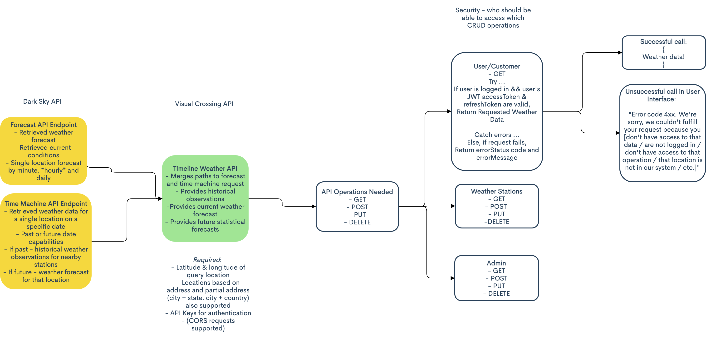

# VisualCrossing Weather Service API

## By Danielle Thompson

## Project Initiated 7.1.2021. Last updated 7.3.21

### Description

The previously used legacy weather system, [Dark Sky API](https://darksky.net/dev), was acquired by Apple and is being shut down. [VisualCrossing](https://www.visualcrossing.com/weather-api) is the new weather source for Cascade Energy's weather data pipeline, and the old data needs to be seamlessly moved to the new API to go with the new data. Old data needs to be traceable to the origin, and none of the old data should be overwritten. This README serves as a roadmap for how to accomplish these goals.

### User Stories

| #  	|  User Stories 	|
|:-:	|:-:	|
|  1 	|  A user should be able to access thousands of locations of hourly weather data. 	|
|  2 	|  A user should be able to access old weather data from the Dark Sky API. 	|
|  3 	|  A user should be able to create new weather data from new locations and times being added hourly without overwriting old weather data. 	|
|  4 	|  A user should be able to trace _all_ data points - new and old - back to their origins. 	|
|  5 	|  A customer should be able to view the queried weather data points. 	|
|  6 	|  A user with weather station credentials should be able to create, read, update, and delete weather data points as they are created and forecasted. 	|
|  7 	|  An admin should be able to create, read, update, and delete all weather data points. 	|

### The API

### Technologies Required

- [Postman](https://www.postman.com/), for testing API endpoints & operations
- [VisualCrossing API](https://www.visualcrossing.com/)
- [VS Code](https://code.visualstudio.com/), or code editor of your choice
- Git & GitHub, or another version control system
- RESTful API
- JWTs & refresh tokens, for authorization
- Node.js
- TypeScript
- A database like MongoDB with Mongoose
- [SwaggerUI](https://swagger.io/), which would allow an admin or weather service to access and test out endpoints before an user interface is built or integrated
- React & JSX, for the user interface
- `create-react-app`
- npm or nvm
- node.js
- webpack
- Babel
- ESLint

### Resources

- [How to replace the Dark Sky API with Visual Crossing Weather API](https://www.visualcrossing.com/resources/documentation/weather-api/how-to-replace-the-dark-sky-api/)
- [How to replace the Dark Sky API using the Visual Crossing Timeline Weather API](https://www.visualcrossing.com/resources/blog/how-to-replace-the-dark-sky-api-using-the-visual-crossing-timeline-weather-api/)
- [Build a REST API with Node.js, TypeScript & MongoDB](https://tomanagle.medium.com/build-a-rest-api-with-node-js-typescript-mongodb-b6c898d70d61)

### Legal

[MIT](https://opensource.org/licenses/MIT) License. _Copyright (c) 2021, Danielle Thompson_.